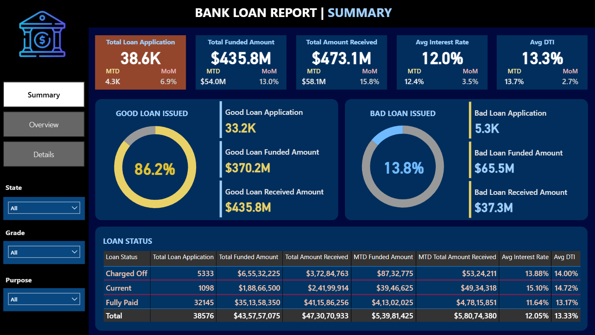
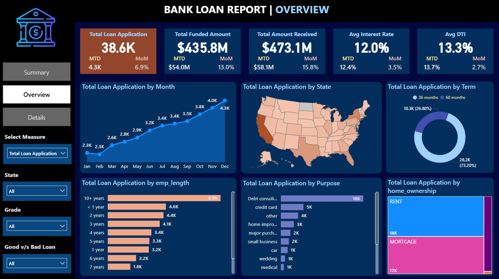

# 📊 Bank Loan Analysis – Data Analytics Project

## ⭐ Overview
This project analyzes bank loan data to identify patterns in loan applications, funded amounts, repayment behavior, borrower characteristics, and loan performance.

It includes:
- **EDA in Python (Pandas, NumPy, Seaborn, Matplotlib, Plotly)**
- **SQL analysis using MySQL**
- **Interactive dashboards in Power BI**
- **Additional dashboard in Excel**

---

## 📂 Dataset
**Table:** `bank_loan_data`

Contains:
- Loan amount, total payment  
- Interest rate, DTI  
- Loan status  
- Issue date  
- Purpose  
- Term  
- Employment length  
- Home ownership  
- Borrower state  

---

## 🛠 Tools & Technologies
| Category | Tools |
|----------|--------|
| **EDA** | Python (Pandas, NumPy, Seaborn, Matplotlib, Plotly) |
| **SQL Analysis** | MySQL |
| **Dashboards** | Power BI, Excel |

---

## 📊 Exploratory Data Analysis (Python)
Performed analysis using Python libraries, including:

- Loan amount distribution  
- Interest rate trends  
- DTI analysis  
- Monthly application patterns  
- Purpose-wise and state-wise insights  
- Outlier detection  
- Correlation heatmaps  
- Interactive visualizations using Plotly  

---

## 🧮 SQL Analysis (MySQL)
Derived key insights such as:

- Total loan applications  
- Monthly performance (MTD, PMTD, MoM)  
- Total funded amount & amount received  
- Avg interest rate & Avg DTI  
- Good vs Bad loan ratio  
- Loan status breakdown  
- Purpose, state, term, grade & employment length analysis  

---

# 📊 Power BI Dashboards

## 📘 Summary Dashboard

## 📈 Overview Dashboard

## 📄 Detail Dashboard

> ⚠️ **Note:**  
Upload your Power BI screenshots into your repo inside an `images/` folder  
and ensure the filenames match the names above.

---

## 📗 Excel Dashboard
An Excel dashboard was also created, containing:

- KPI Summary  
- Monthly loan trends  
- Loan status distribution  
- Purpose-wise charts  
- Simple, clean data visuals for easy sharing  

---

## 📌 Key Insights
- **86%** of loans are Good Loans  
- **Debt Consolidation** is the most popular purpose  
- December recorded the highest applications  
- Most borrowers have **Mortgage** home ownership  
- 60-month term loans show slightly higher risk  

---

## 📥 Project Deliverables
- `bank_loan_db.sql`  
- Python EDA Notebook  
- Power BI Dashboard (`.pbix`)  
- Excel Dashboard (`.xlsx`)  
- README.md  

---

## 🎯 Summary
This project highlights strong skills in:

- Python-based exploratory data analysis  
- SQL-based analytical reporting  
- Power BI & Excel dashboard development  
- Financial insight generation  
- End-to-end data analytics workflow  

